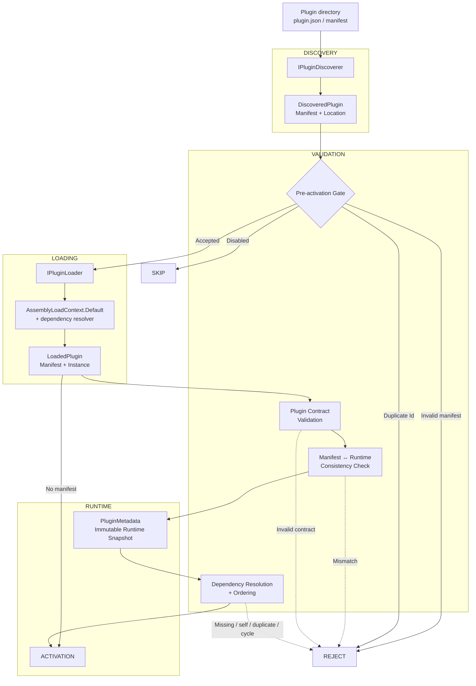

# ADR-017: Plugin Contract and Dynamic Loading Architecture

## Context

The `AuthKit.Host` project requires dynamic plugin discovery and loading at startup, before the DI container and infrastructure (Wolverine, Marten) are fully configured. The existing `IAuthKitPlugin` interface only exposed `Name`, `Version` (as string), and `Description`, which was insufficient for proper plugin lifecycle management, compatibility checking, and dependency resolution.

The `PluginLoader.LoadPlugins()` method signature changed from 2 to 3 required parameters (`pluginsRootPath, ILogger logger, SemanticVersion hostVersion`), causing a compile error that needed to be fixed by extracting the host version from assembly metadata.

## Problem

1. **Compile error**: `PluginLoader.LoadPlugins(pluginsPath, pluginLogger)` called with 2 arguments but method requires 3 required parameters
2. **No host version awareness**: Plugins could not be rejected based on minimum host version requirements (`MinHostVersion` gate G3)
3. **No manifest support**: No pre-activation validation of plugin metadata (tags, dependencies, enabled status, consistency checks)
4. **No stable plugin identification**: No unique `Id` field for deduplication, dependency resolution, and host uniqueness
5. **No capability classification**: No `Capabilities` set for pre-activation host checks

## Decision

### A1. Plugin Id (`IAuthKitPlugin.Id`)
- Added `string Id { get; }` to `IAuthKitPlugin` interface
- Plugin authors declare stable identifiers (e.g., `authkit.devtokens`)
- Host validates format and uniqueness before activation
- **Rejected**: Using `Guid` as `Id` (poor readability in manifests, logs, CLI, and config)

### A2. Strongly-typed Version (`IAuthKitPlugin.Version`)
- Replaced `string Version` with `SemanticVersion Version`
- SemVer 2.0.0 parsing, equality, and comparison with correct precedence
- Build metadata ignored for precedence (`1.0.0+abc == 1.0.0+xyz`)
- **Breaking change**: Existing `string Version => "1.2.3"` implementations must migrate to `SemanticVersion Version`

### A3-A8. Descriptive Metadata Surface
- `string? Author`, `string? License`, `string? LicenseUrl`, `string? Homepage`, `string? RepositoryUrl`
- `IReadOnlyList<string> Tags` - free-form classification, null/whitespace elements invalid. Defaults to `Array.Empty<string>`.
- `int Priority` - lower value = earlier activation among otherwise independent plugins. Dependencies always take precedence over `Priority`. Defaults to `0`.
- `bool IsEnabled` - defaults to `true`. When `IsEnabled` is provided by a manifest, disabled plugins are skipped before assembly activation.
- `string? DisplayName` - UI shows `DisplayName ?? Name` fallback rule. Defaults to `null`.
- `IReadOnlyList<string> DependsOn` - declares plugin `Id` values (never display names). Defaults to `Array.Empty<string>`.

### A9. MinHostVersion
- **Deferred**: `MinHostVersion` is not part of the current plugin contract but is planned for future implementation.
- **Note**: Host compatibility checks (G3) are not currently enforced. This feature will be reintroduced when `MinHostVersion` is added to the contract in a future iteration.

### A10. DependsOn
- `IReadOnlyList<string> DependsOn` - declares plugin `Id` values (never display names)
- **Cycle Detection**: Cycles in dependencies are detected using a **Depth-First Search (DFS)** algorithm with a `visiting` set to track the current traversal path. If a cycle is detected, all plugins involved in the cycle are rejected as a startup error.
- **Priority Resolution**: The `Priority` field (A3-A8) resolves ties **only within a valid topological order** and does not override dependency edges (`DependsOn`).
- G7 validates: missing → startup error, self → reject, duplicate → reject, cycle → startup error

### A11. Capabilities
- `IReadOnlySet<string> Capabilities` - case-insensitive ordinal set equality. Defaults to an immutable empty set.
- Used for pre-activation host capability checks and runtime contract validation.

### A12. PluginMetadata
- Immutable runtime snapshot via `PluginMetadataExtensions.GetMetadata()`
- Aggregates the plugin contract metadata into a single immutable runtime snapshot
- Consistency check between manifest and runtime instance (G2) mismatch → reject
- **Note**: Consistency validation focuses on non-version-related metadata (e.g., `Tags`, `DependsOn`, `Capabilities`).

### A13. DisplayName
- `string? DisplayName` provides a human-readable plugin name for UI and diagnostics.
- Falls back to `Name` when not specified.

### B. PluginManifest Pre-Activation Projection
- `PluginManifest` mirrors selected runtime members of `IAuthKitPlugin` for pre-activation use (G2)
- Searched from plugin directories: `plugin.manifest.json`, `manifest.json`, `{pluginName}.manifest.json`
- **Manifest Future Direction**: While manifests are currently optional for backward compatibility, the long-term goal is to enforce mandatory manifests for full consistency validation (G2). Plugins without manifests load without validation, which may lead to unexpected behavior in future releases.
- If manifest not found: `manifest` is `null`, plugin loads without consistency validation (fallback path)
- If manifest found: validated tags, depends-on, IsEnabled, duplicate Id check
- Consistency check between manifest and runtime instance after loading.

### C. Validation and Loading

#### Pre-activation validation (when manifest exists)
1. **Plugin discovery**: Scan `pluginsRootPath` for subdirectories
2. **Entry assembly check**: Each directory must contain `{pluginName}.dll`
3. **Manifest parsing**: Try `plugin.manifest.json` → `manifest.json` → `{pluginName}.manifest.json`

**Note**: The host derives its `SemanticVersion` from assembly metadata and passes it explicitly to `PluginLoader`. This value is currently informational and is not used for plugin compatibility validation. Compatibility gating via `MinHostVersion` is deferred.

5. **Pre-activation validation** (when manifest exists):
   - Validate manifest syntax and structure
   - Validate `Tags`
   - Validate `DependsOn` (missing, self, duplicate, cycle)
   - Validate `IsEnabled`
   - Validate duplicate `Id`
   - Disabled plugins (`IsEnabled = false`) are skipped before assembly activation.

6. **Assembly loading**: `AssemblyLoadContext.Default.LoadFromAssemblyPath()` with dependency resolver

#### Runtime validation (after assembly loading)
7. **Plugin instantiation**: `Activator.CreateInstance(pluginType)` → `IAuthKitPlugin`
8. **Duplicate `Id` check at load-time**
9. **Consistency validation** between manifest and runtime instance (if manifest exists)
   - Validates non-version-related metadata (e.g., `Tags`, `DependsOn`, `Capabilities`).
10. **Create `PluginMetadata`** as an immutable snapshot of the runtime contract
11. **Activate the plugin**

**Notes:**
- `MinHostVersion` is planned for future implementation to enforce host-version compatibility (G3).
- Manifest consistency validation focuses on non-version-related metadata, including `Tags`, `DependsOn`, and `Capabilities`.
- Manifests remain optional for backward compatibility; plugins without manifests follow the fallback loading path without consistency validation.

### Tags
#PluginContract #DynamicLoading #G2 #G7

### Date
2026-09-04

### Scope
Plugins

### Previous
ADR-016: Using Marten and Wolverine as the host infrastructure

### Next
N/A (latest in collection)

## Consequences

### Positive
- Plugins can be referenced by stable unique identifier (`Id`)
- Plugin metadata can be validated before activation when a manifest is available
- Disabled plugins can be skipped before assembly activation when declared by manifest
- Plugin contract metadata is available as an immutable `PluginMetadata` snapshot
- Dependency declarations can be validated and resolved deterministically
- Manifest/runtime inconsistencies can be detected before activation
- Plugin metadata is available before DI container setup
- New contributors can understand the plugin contract and loading decisions

### Negative
- `Version` change from `string` to `SemanticVersion` is breaking (requires migration)
- Plugins without a manifest still load without manifest/runtime consistency validation
- Host-version compatibility (`MinHostVersion`) is planned for future implementation
- Manifest enforcement is deferred to a future iteration
- More compile-time and contract validation is required for plugin authors

### Consequences Diagram

**Diagram Explanation**:
- **Discovery**: `IPluginDiscoverer` scans plugin directories and parses manifests.
- **Pre-activation Gate**: Validates manifest syntax, `Tags`, `DependsOn`, `IsEnabled`, and duplicate `Id`.
- **Loading**: Loads assemblies and instantiates `IAuthKitPlugin`.
- **Validation**: Ensures contract consistency between manifest and runtime instance.
- **Dependency Resolution**: Validates and orders plugins based on `DependsOn` and `Priority`.
- **Activation**: Final step after successful validation and resolution.