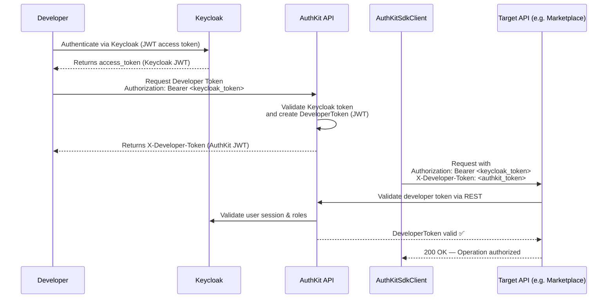
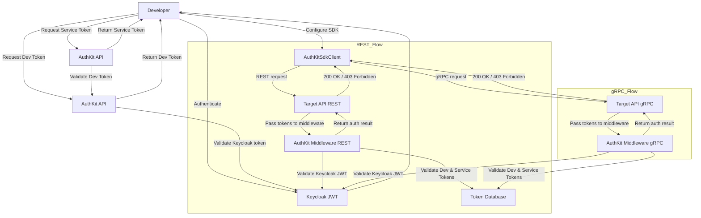
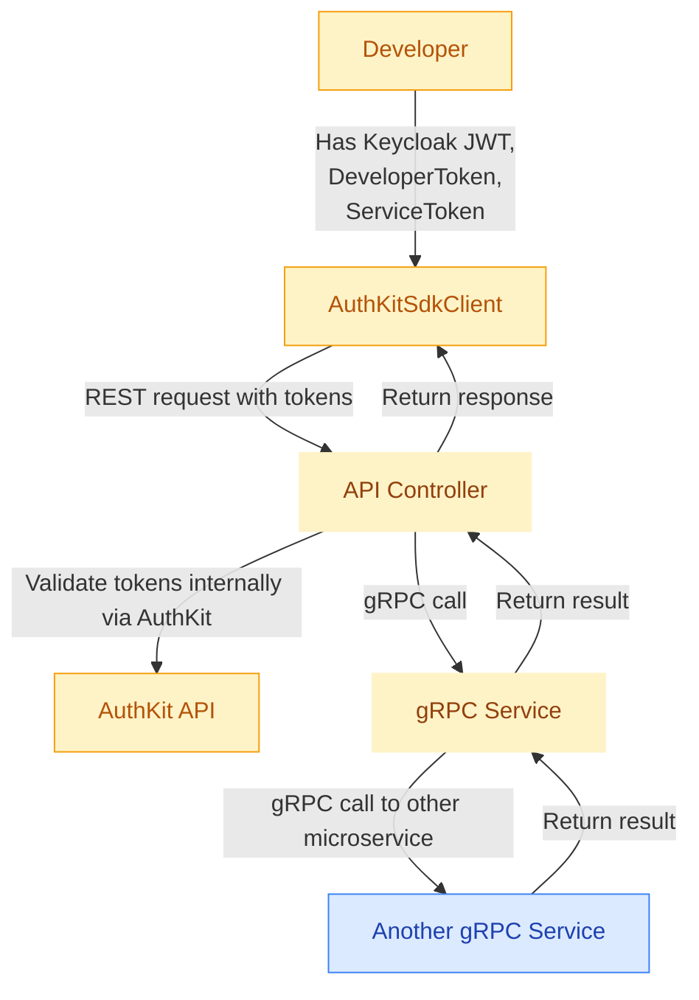

# AuthKit Schemas

This document contains the Mermaid diagrams describing AuthKit's token flows and architecture.

## Token Issuance & SDK Request Flow

## External REST vs Internal gRPC Call Flow

## SDK Function Call Flow (AuthKit → gRPC Microservices)

