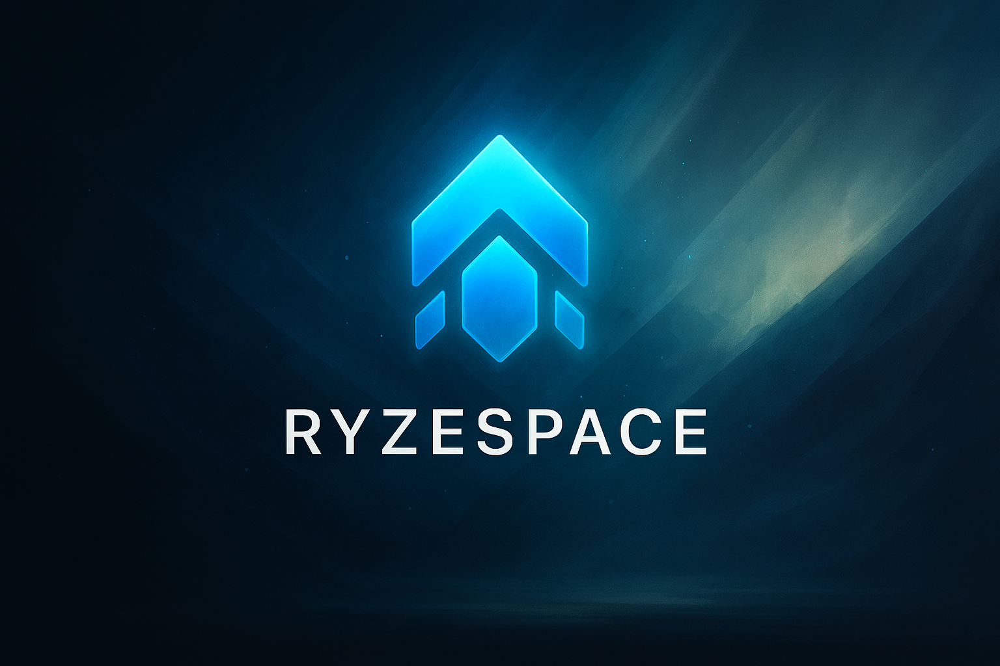

<div align="center">

# RyzeSDK.AuthKit

### Developer Authentication & SDK Access Service

[](LICENSE)
[](https://dotnet.microsoft.com)

</div>


---

## Overview
RyzeSDK.AuthKit is the **centralized microservice** for handling **developer authentication, SDK token issuance, and access verification** across the RyzeSpace SDK ecosystem.

It ensures that only authorized developers can access SDK methods and provides a secure, auditable token-based authentication mechanism.

## Why AuthKit Matters

In a distributed SDK ecosystem, AuthKit provides:

- **Secure Access** — Issue and validate dev tokens for SDK usage
- **Role Enforcement** — Restrict SDK methods to authorized roles (SDK_Dev)
- **Audit & Traceability** — Track issued tokens and access events
- **Extensibility** — Easy to add policies, limits, or new developer roles

## Token Flow Example

- **Developer registers → DevAccessService** issues a token
- **SDK client** (RyzeSdkClient) stores token
- **SDK methods** attach token to REST/gRPC requests
- **AuthKit** verifies token & role → executes method if authorized

## Contributing

We welcome contributions that improve contract clarity, expand integration patterns, or enhance type safety.

### Development Guidelines

1. **Branch Strategy** — Create feature branches from `main`
   ```bash
      git checkout -b feature/token-policies
   ```
2. **Versioning** — Use semantic versioning (MAJOR.MINOR.PATCH)
    - MAJOR: Breaking changes
    - MINOR: New contracts (backward compatible)
    - PATCH: Bug fixes, documentation

3. **Pull Request** — Provide clear descriptions of changes and impact

## License

**MIT License + Commons Clause**

The RyzeSpace.Contracts library is open source for personal, educational, and research purposes. Commercial use requires explicit permission.

### Permitted Use ✓

- Personal projects and learning
- Academic research and education
- Open source contributions
- Non-commercial experimentation

### Restricted Use ✗

- Commercial products and services
- SaaS platform offerings
- Software resale or licensing
- Consulting services without approval

See [LICENSE](LICENSE) for complete terms.

---

<div align="center">

### Part of the RyzeSpace Ecosystem

**Democratizing access to computational resources through decentralized sharing**

*Every idle GPU, every spare CPU cycle — unlocking potential in the RyzeSpace network*

<br/>

**[Documentation](https://docs.ryzespace.com)** • **[Platform](https://ryzespace.com)** • **[Community](https://discord.gg/JsQx8cQ5yp)**

<br/>

<sub>Built with precision by the RyzeSpace team</sub>

</div>